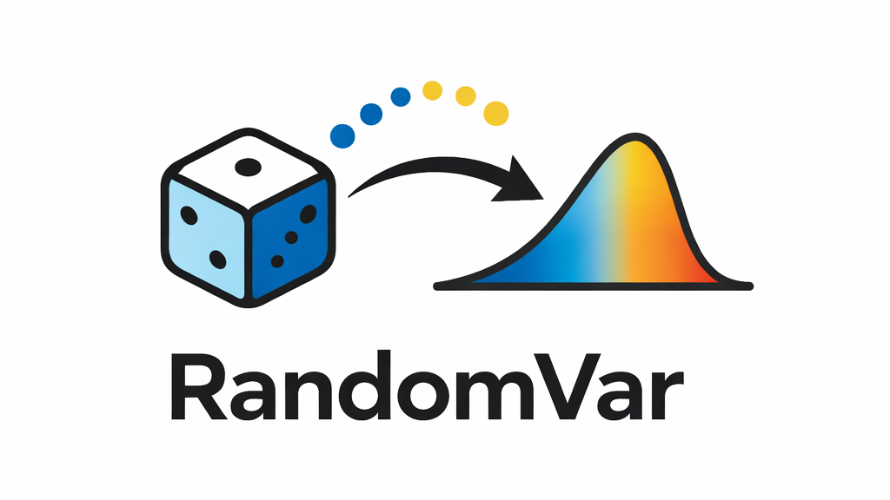

### RandomVar: A Symbolic Library for Random Variables

---
### Overview
***randomvar*** is a Python package that provides a comprehensive, symbolic, library for discrete and continuous random variables. The objective is to provide a robust set of statistical tools that are easy to use and well documented.

### Table of Contents